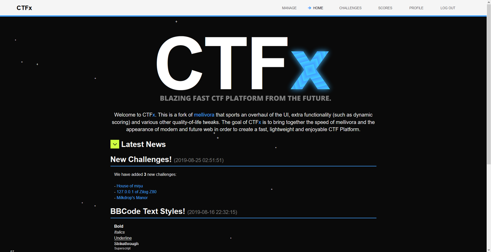

CTFx
=========

CTFx is a CTF Platform forked from [mellivora](https://github.com/Nakiami/mellivora), that focuses on low memory footprint and low server CPU usage. It has a futuristic interface that's optimized for slower hardware, meaning that there is no bulky Javascript running in the background, nor lengthy CSS stylesheets. CTFx improves on the mellivora CTF engine by the UI redesign and the addition of new features.

  

## Features
- Unlimited categories and challenges with configurable dynamic/static scoring
- Challenge hints
- Unlockable challenges (In order to see them requires you to solve another challenge (from any category you choose))
- Admin Panel with competition overview, IP logging, user/email search, exception log (that includes the users that caused them)
- Create/edit front page news
- Markdown support for challenges and categories and news
- hCaptcha support
- Configurable caching
- Caching proxy (like [Cloudflare](https://www.cloudflare.com/)) aware (optional x-forwarded-for trust)
- TOTP two factor auth support
- And more...

## Looks
CTFx has a slick modern interface. See the [gallery](gallery.md).

## Performance
CTFx is extremely lightweight and fast. See the [benchmarks](benchmarks.md).

## Installation
**- Install the following dependencies**
  - `nginx php-fpm php-mysql php-curl php-mbstring mariadb-server` (or `mysql-server` instead of `mariadb-server`)

**- Secure mysql server**
  - Run the command `mysql_secure_installation` and remove anonymous users, disable root login and remove the test database

**- Setup CTFx**
  - Clone this repository's contents to /var/www/ctfx/
  - Make the folder `writable` writable

**- Setup nginx**
  - Copy the recommended nginx config `install/recommended_nginx_config` to `/etc/nginx/nginx.conf` - For the fastcgi_pass entry, you must change the PHP version to your current one.
  - Make sure to restart nginx after changing the config!

**- Setup MySQL**
  - sudo into `mysql`, then run the following queries:
  - `CREATE DATABASE ctfx CHARACTER SET utf8mb4 COLLATE utf8mb4_unicode_ci;`
  - `CREATE USER 'ctfx'@'%' IDENTIFIED BY 'ctfx_pass';` - Make sure you change the default db username and password!
  - `GRANT ALL PRIVILEGES ON ctfx.* TO 'ctfx'@'%';`
  
  - exit `mysql`
  - `sudo mysql < install/sql/001-ctfx.sql`
  - `sudo mysql < install/sql/002-countries.sql`

**- Create Admin User**
  - Register your admin account on the website (and enable 2FA Authentication preferably)
  - Logout of your account
  - sudo into `mysql` and run the query `USE ctfx; UPDATE users SET admin=1 WHERE id=1;`

## Installation Tips:
- It is **recommended** that you change the default database password, and if you do so you must also change it in `include/config/db.inc.php`
- You can change the homepage to your liking by modifying `htdocs/home.php`. Make sure to also change the css rules in `htdocs/css/mellivora.min.css` for #ctfx-main-logo and .main-intro-text, if you want a different overall style.
- You might want to change the `CTF_START_TIME` and `CTF_END_TIME` variables in `include/config/config.inc.php`, so that each new challenge you create will have these times set as default.

## License
This software is licenced under the [GNU General Public License v3 (GPL-3)](http://www.tldrlegal.com/license/gnu-general-public-license-v3-%28gpl-3%29). The "include/thirdparty/" directory contains third party code. Please read their LICENSE files for information on the software availability and distribution.
