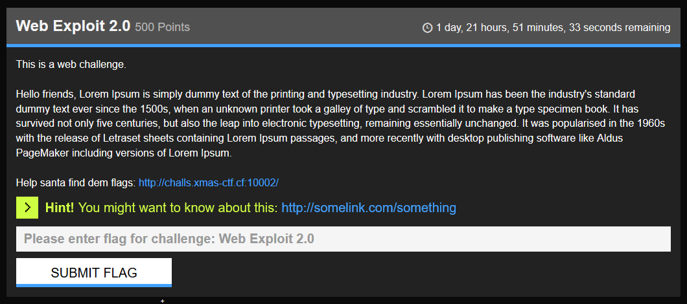
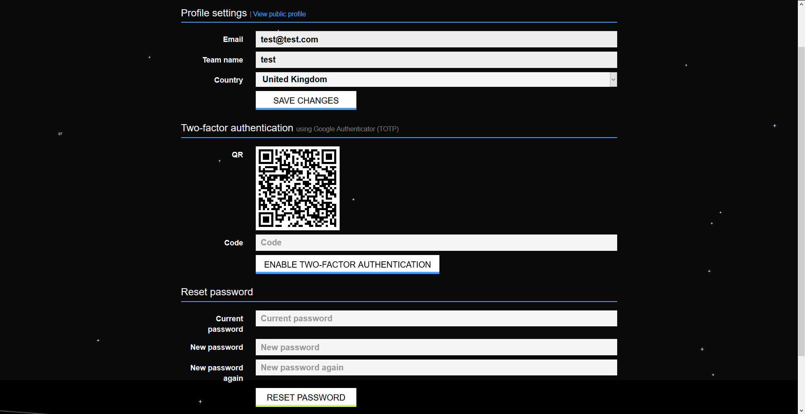
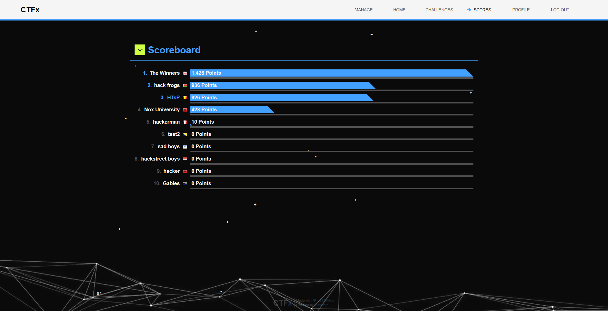
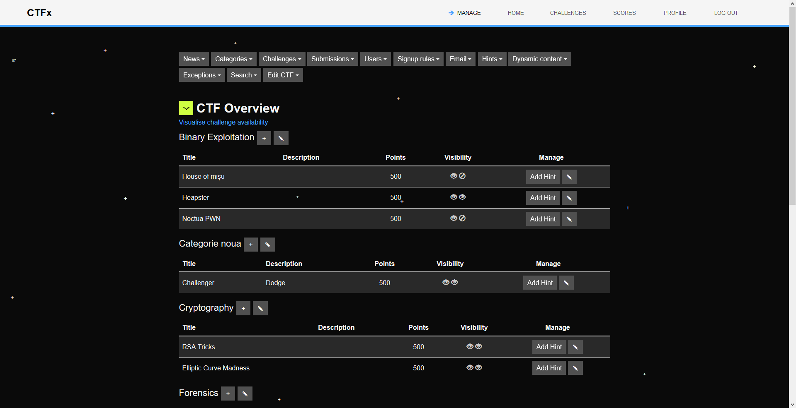
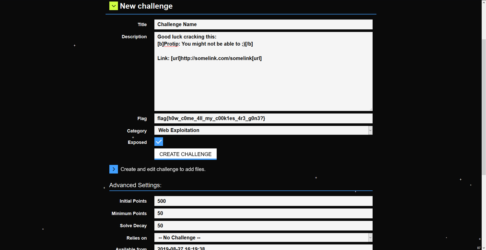
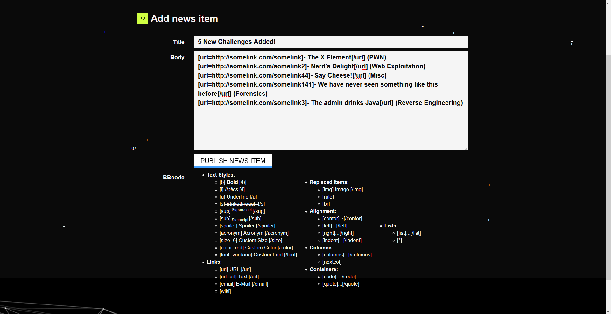
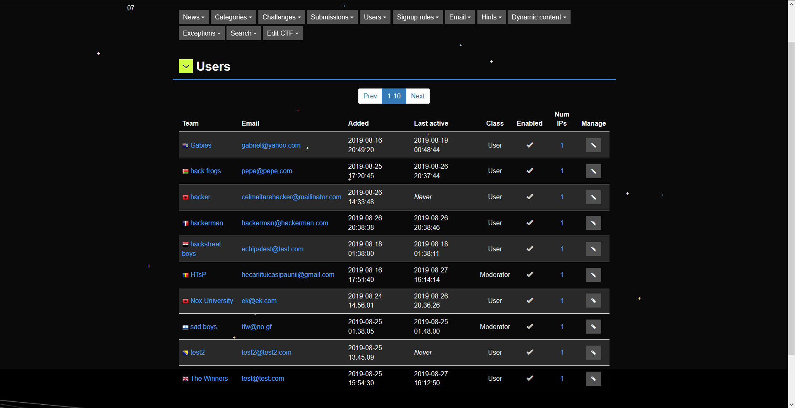
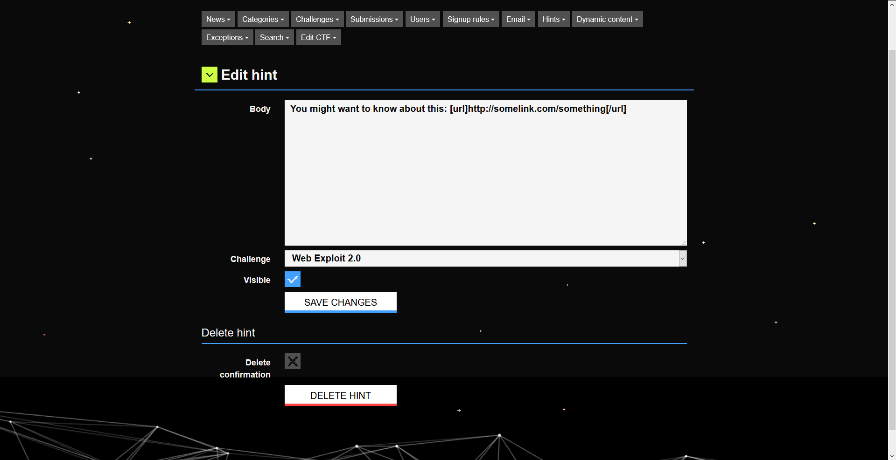

Gallery
=========

Here are some screenshots of CTFx:

## Homepage

  

## Challenges page

  

## Challenge Body

  

## User profile

  

## Scoreboard

  

## Admin Panel

  

## Admin - New Challenge

  

## Admin - Add News

  

## Admin - View Users

  

## Admin - Edit Hint

  

